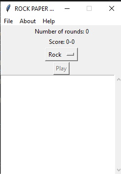

# Rock-Paper-Scissors


[](https://www.python.org/) [](http://perso.crans.org/besson/LICENSE.html) 

# Table of contents

<!--ts-->
  * [Rock-Paper-Scissors](#Rock-Paper-Scissors)
  * [Table of contents](#Table_of_contents)
  * [Files/Folders](#Files/Folders)
  * [Dependencies](#Dependencies)
  * [Current Version](#Current_Version)
  * [Documentation](#Documentation)
  * [Radon](#Radon)
    * [Radon cc](#Radon_cc)
    * [Radon hal](#Radon_hal)
    * [Radon mi](#Radon_mi)
    * [Radon raw](#Radon_raw)
  * [Keybinds](#Keybinds)
  * [License](#License)
<!--te-->


## Files/Folders
<ul>
  <li> doc (documentation folder) </li>
  <li> images (images folder) </li>
</ul>


## Dependencies

To install the dependencies run

```shell
pip install -r requirements.txt
```


## Current Version

<p> </p>

## Documentation

All project documentation is located in the `./doc`  folder.

## Radon

### Radon_cc


### Radon_hal

<p></p>

### Radon_mi

<p></p>

### Radon_raw

<p></p>

## Keybinds

<ul>
  <li> New Game(Ctrl+O) </li>
  <li> Exit(Alt+F4) </li>
  <li> About(Ctrl+I) </li>
  <li> Help(Ctrl+F1) </li>
</ul>

## License
[GNU GPLv3](https://choosealicense.com/licenses/gpl-3.0/)